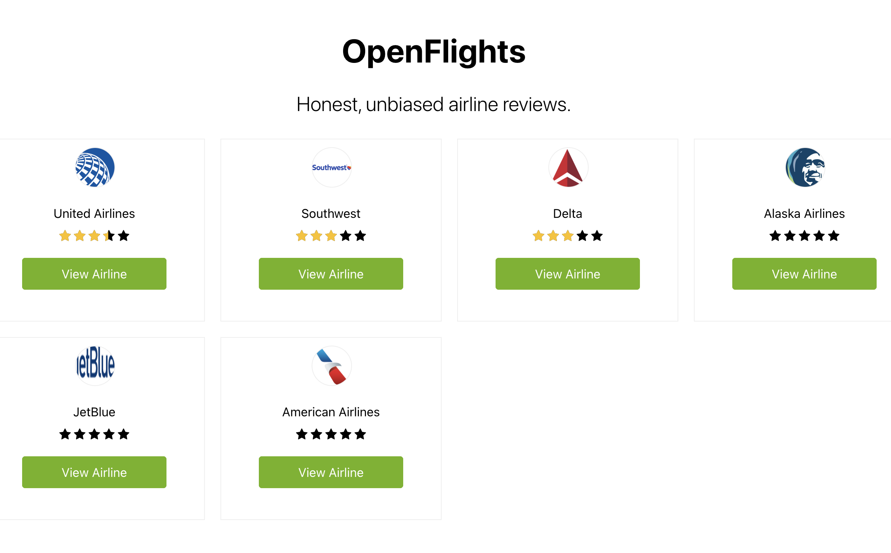
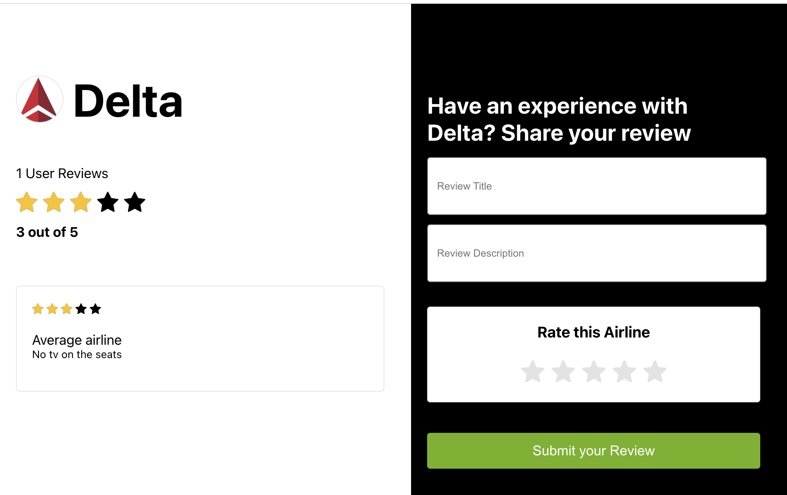

<h1 align="center">
    Airlines Review
     
</h1>

# Overview

The App creates and shows the reviews of some airlines. It was build on Ruby on Rails and React.js

This app uses:

- Ruby version 3.1.2
- Rails version: 7.0.3.1
- Database: postgresql
- React version: 18.2.0
- React Hooks API

# Running it locally

run `bundle exec rails db:prepare`

run `bundle exec rails s`

cd into /airlinesreview

run `npm install` or `yarn install`

run `npm install` or `yarn start`

navigate to http://localhost:3001

# Screenshots

 

